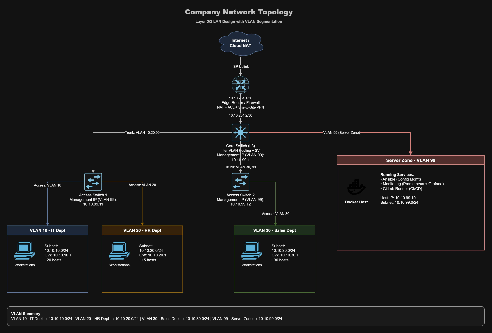

# NetDevOps — Enterprise Network Automation Project

Automated enterprise network management using **Infrastructure as Code (IaC)** principles.
A simulated company network built in **GNS3**, managed with **Excel, Git, Ansible and GitHub Actions**.

## Overview

This project applies DevOps practices to network operations (**NetDevOps**):

- `network-config.xlsx` is the human-friendly **Source of Truth** for VLAN configuration.
- **Ansible** generates and pushes configuration to Cisco devices automatically.
- **GitHub Actions** validates Excel, generates inventory YAML, runs checks, deploys, verifies and backs up configuration.
- **Prometheus + Grafana** monitor the environment.
- Configuration changes are versioned in Git.

The VLAN workflow is designed so that normal changes can be made from a single row in Excel.

## VLAN Management from Excel

The main editable sheet is `VLANs`.

| Column | Example | Purpose |
|---|---|---|
| VLAN ID | `50` | VLAN number |
| Name | `FINANCE` | VLAN name |
| Subnet | `10.10.50.0/24` | VLAN network |
| Gateway | `10.10.50.1` | SVI gateway |
| Device | `sw-acc1` | Access switch |
| Interface | `GigabitEthernet0/3` | Access interface |
| Description | `PC-FINANCE` | Interface description |
| DHCP | `TRUE` | Enable DHCP |

`Device` is selected from `sw-acc1` or `sw-acc2`.

### Example: add VLAN 50

Add one row to `network-config.xlsx`:

```text
50 | FINANCE | 10.10.50.0/24 | 10.10.50.1 | sw-acc1 | GigabitEthernet0/3 | PC-FINANCE | TRUE
```

After the Excel file is committed and pushed, CI/CD will automatically:

```text
Create VLAN 50
   ↓
Ensure VLAN 50 is no shutdown
   ↓
Create SVI Vlan50
   ↓
Configure DHCP pool
   ↓
Add VLAN 50 to managed trunks
   ↓
Configure sw-acc1 GigabitEthernet0/3 as access VLAN 50
```

There is no need to manually update trunk allowed VLAN lists when adding a VLAN.

## Edit and Delete Behavior

The Excel workbook is treated as the desired network state.

### Edit

Changing the VLAN row and pushing the workbook causes the generated Ansible configuration to be updated and redeployed.

### Delete

Removing a VLAN row from Excel means the VLAN is no longer desired.

During deployment Ansible gathers the current VLAN state and removes VLANs that exist on the managed switches but are absent from Excel.

Deletion also cleans up related configuration:

```text
VLAN removed from Excel
        ↓
Delete VLAN from switches
        ↓
Remove SVI Vlan<ID>
        ↓
Remove DHCP pool VLAN<ID>
```

The Cisco default/reserved VLANs are protected:

```text
1, 1002, 1003, 1004, 1005
```

> VLANs created manually on managed switches but not listed in Excel can be removed by the next deployment. Keep all managed VLANs in `network-config.xlsx`.

## Re-adding a Deleted VLAN

When a VLAN is added back to Excel, the VLAN role creates it again and explicitly applies:

```text
vlan <ID>
 no shutdown
```

The SVI is also created with `no shutdown`, so manual CLI recovery is not required.

## Network Topology



### IP / VLAN Plan

| VLAN | Name | Subnet | Gateway |
|---:|---|---|---|
| 10 | IT | 10.10.10.0/24 | 10.10.10.1 |
| 20 | HR | 10.10.20.0/24 | 10.10.20.1 |
| 30 | SALES | 10.10.30.0/24 | 10.10.30.1 |
| 40 | MARKETING | 10.10.40.0/24 | 10.10.40.1 |
| 99 | SERVER-MGMT | 10.10.99.0/24 | 10.10.99.1 |
| — | Transit | 10.10.254.0/30 | — |

### Management IPs

| Device | Role | Management IP |
|---|---|---|
| r-edge | Edge Router | 10.10.254.1 |
| sw-core | Core L3 Switch | 10.10.99.1 |
| sw-acc1 | Access Switch | 10.10.99.11 |
| sw-acc2 | Access Switch | 10.10.99.12 |
| docker01 | Automation Host | 10.10.99.10 |

## Security Policy

- HR (VLAN 20) is denied access to the Server/MGMT network by ACL.
- Devices are managed through SSH.
- Credentials remain outside Excel and are protected with **Ansible Vault** and GitHub Secrets.

## Tech Stack

| Tool | Role |
|---|---|
| GNS3 | Cisco network simulation |
| Excel | Human-friendly VLAN Source of Truth |
| Python | Validate Excel and generate Ansible YAML |
| Git / GitHub | Version control and review |
| Ansible | Network configuration and deployment |
| GitHub Actions | CI/CD validation, dry-run and deployment |
| Prometheus + Grafana | Monitoring |

## Repository Structure

```text
netdevops-project/
├── network-config.xlsx
├── README.md
├── ansible.cfg
├── .github/
│   └── workflows/
│       ├── deploy.yml
│       └── pr-check.yml
├── tools/
│   ├── generate_inventory.py
│   └── requirements.txt
├── inventory/
│   ├── hosts.yml
│   ├── group_vars/
│   └── host_vars/
├── roles/
│   ├── vlan/
│   ├── routing/
│   ├── dhcp/
│   ├── acl/
│   ├── nat/
│   └── snmp/
├── playbooks/
│   ├── deploy.yml
│   ├── verify.yml
│   └── backup.yml
├── backups/
├── docker/
└── docs/
    ├── excel-config.md
    ├── ip-plan.md
    └── topology.jpg
```

## Excel Validation

Install the generator dependencies locally if needed:

```bash
python -m pip install -r tools/requirements.txt
```

Validate Excel without changing YAML:

```bash
python tools/generate_inventory.py --check
```

Generate Ansible YAML:

```bash
python tools/generate_inventory.py
```

The validator checks VLAN IDs, subnets, gateways, devices, access interfaces and other references before deployment.

The parser only reads the main table columns of each sheet, so instruction panels located to the right of the Excel table are ignored.

## CI/CD Pipeline

### Push to `main`

```text
Push network-config.xlsx
        ↓
GitHub Actions self-hosted runner
        ↓
Create .venv
        ↓
Install openpyxl + PyYAML
        ↓
Validate Excel
        ↓
Generate inventory YAML
        ↓
Ansible syntax check
        ↓
Deploy
        ↓
Verify
        ↓
Backup configuration
```

The self-hosted runner uses a Python virtual environment so package installation does not conflict with Ubuntu's PEP 668 `externally-managed-environment` protection.

### Pull Request

```text
Pull Request
    ↓
Validate Excel
    ↓
Generate YAML
    ↓
yamllint / ansible-lint
    ↓
Ansible --check --diff
```

## Normal VLAN Workflow

For most VLAN changes, only the Excel workbook needs to be edited:

```bash
git add network-config.xlsx
git commit -m "feat: update network vlan configuration"
git push origin main
```

GitHub Actions handles validation, YAML generation and deployment.

For generator or Ansible logic changes, commit the related code files as well.

## Common Ansible Commands

```bash
# Validate generated deployment syntax
ansible-playbook playbooks/deploy.yml --syntax-check

# Preview configuration changes
ansible-playbook playbooks/deploy.yml --check --diff

# Deploy
ansible-playbook playbooks/deploy.yml

# Verify
ansible-playbook playbooks/verify.yml

# Backup
ansible-playbook playbooks/backup.yml
```

## Monitoring

| Service | Port | Purpose |
|---|---:|---|
| Grafana | 3000 | Dashboards |
| Prometheus | 9090 | Metrics collection |
| CI Runner | — | GitHub Actions self-hosted deployment runner |

## Documentation

- [Excel Configuration Guide](docs/excel-config.md)
- [IP & VLAN Plan](docs/ip-plan.md)
- [Topology Diagram](docs/topology.jpg)
